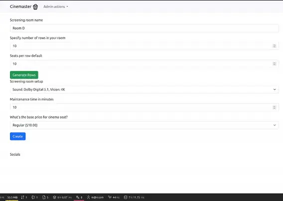
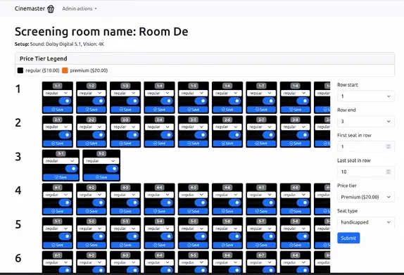
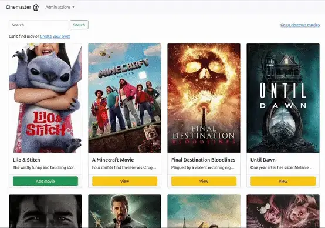
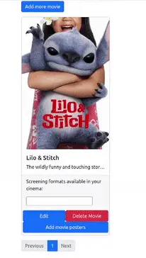
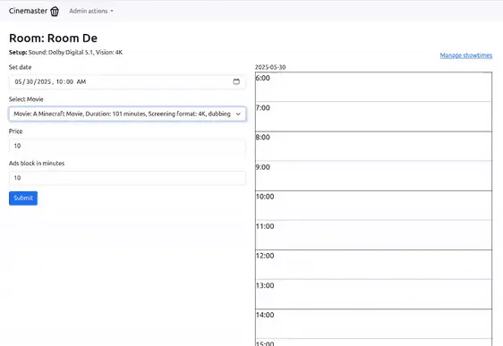
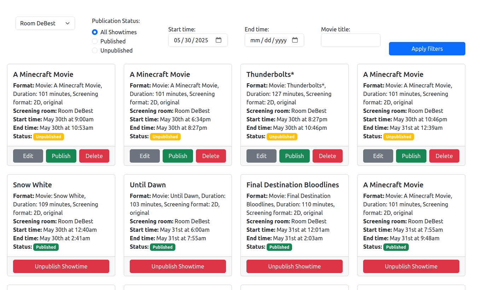
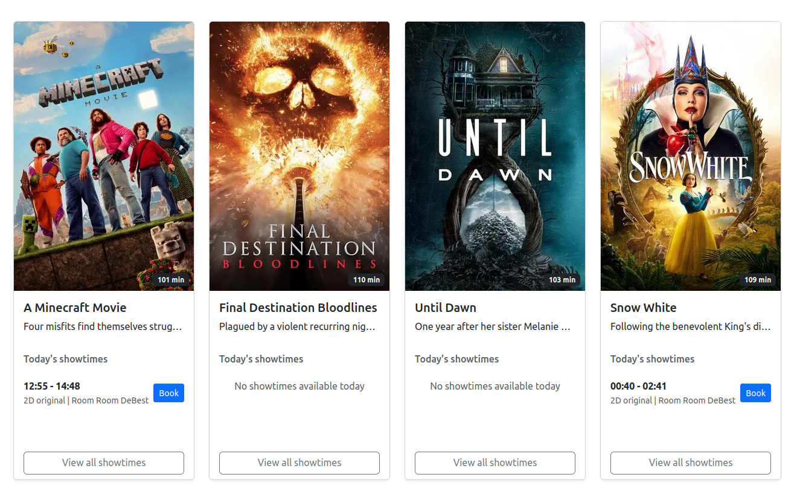
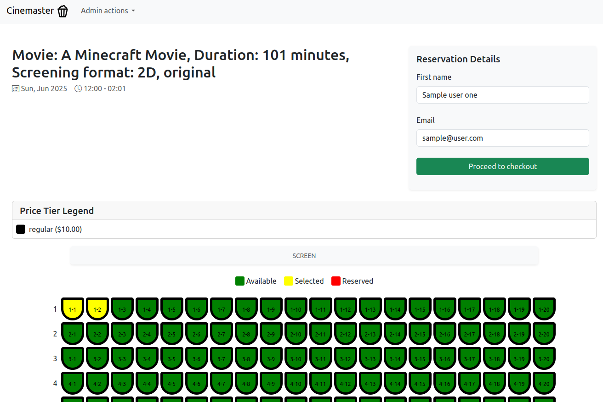
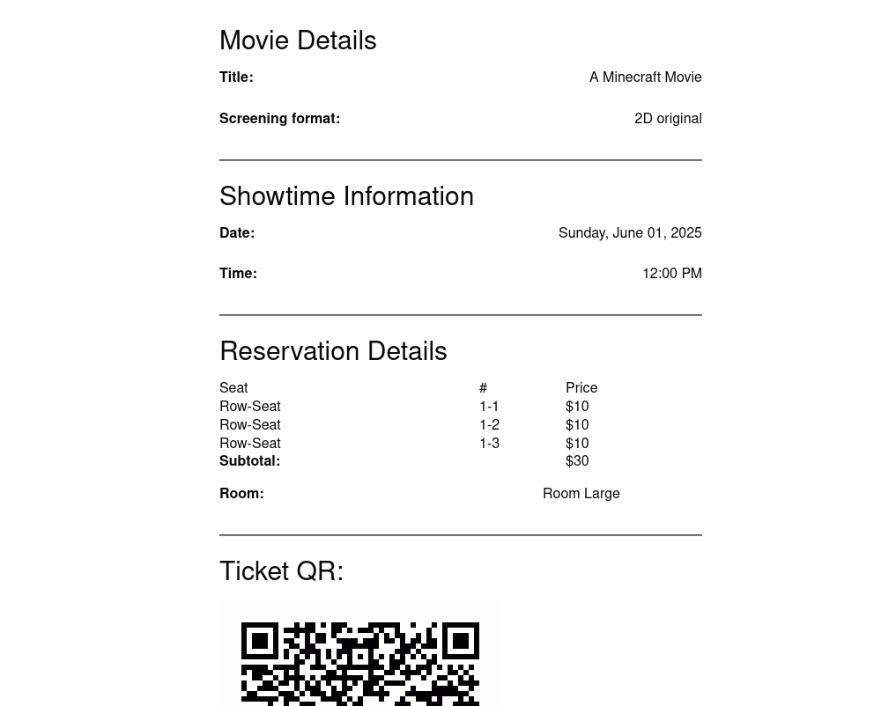

# 🎬 Cinema Admin Panel & User Interface Overview

## 🛠️ Admin Panel

### 1. Cinema Creation

A straightforward form to create a new cinema.  
**Features:**

- Basic details input (name, location, etc.)
- Adding available visual formats which serve as the base for screening room setups and screening formats for movies

---

### 2. Screening Room Creation

#### Initial Room Setup

Specify the number of rows and default seats per row.

Each row is represented as a field, and each field accepts the number of seats in that row.

#### Room Editing

Customize seat arrangement per row.  
**Features:**

- Disable specific seats
- Assign seat types (e.g., VIP, Economy)
- Set individual seat pricing

---

### 3. Adding or Creating Movies

#### Movie Selection

Choose a movie from a database or create a new one from scratch.

#### Format Selection

After a movie is selected, define which formats (2D, 3D, etc.) are available in this cinema.

---

### 4. Scheduling Showtimes

#### Show Setup

Schedule a showtime and see it placed on a timeline interface.

#### Conflict Detection

Visual detection of overlapping or conflicting showtimes.

---

### 5. Show Management

Manage scheduled shows, edit or remove existing ones.

---

## 👤 User Perspective

### 1. Cinema Selection

User selects a preferred cinema location.

### 2. Viewing Scheduled Premieres

All upcoming premieres are displayed.

### 3. Reservation Panel

Users select seats and proceed to purchase.

After payment is completed, user receives email with the show details. The QR code is later scanned by employee that invalidates the reservations on entrance.

---
